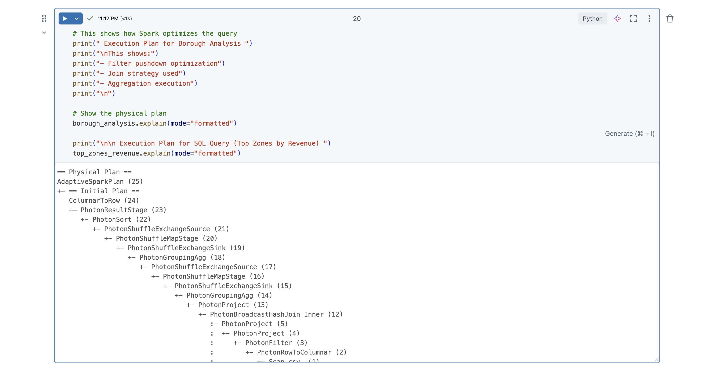
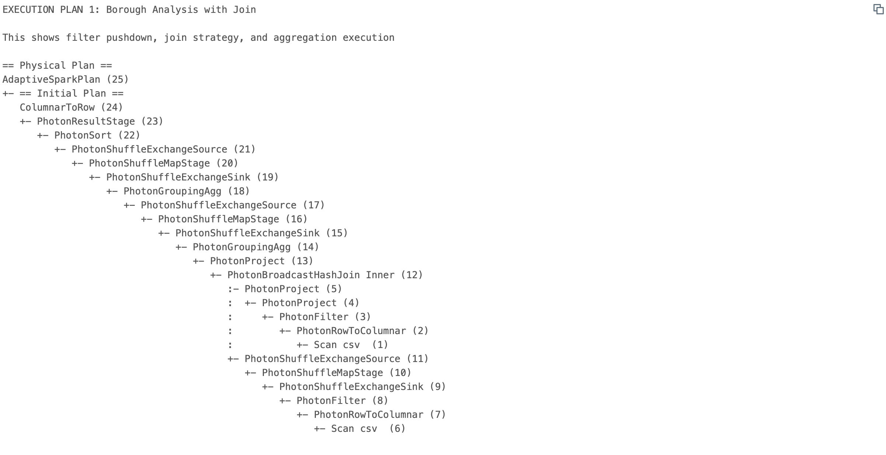
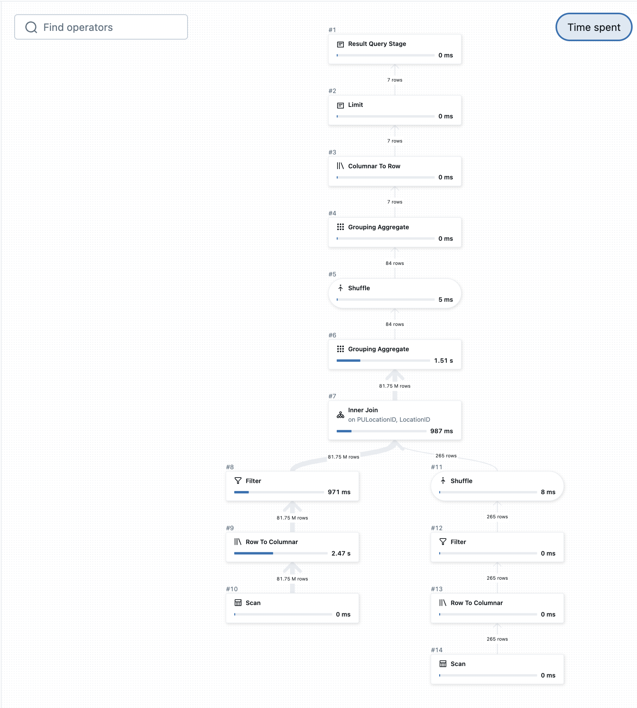
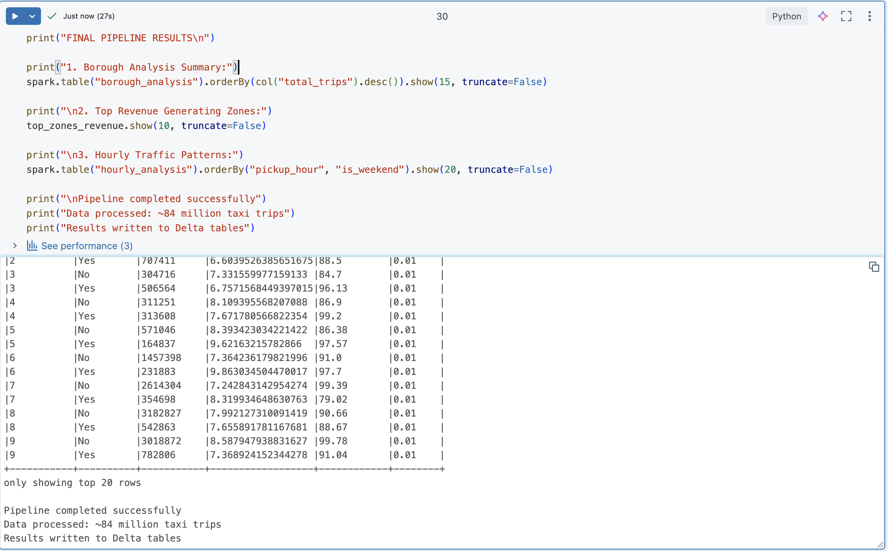

# PySpark Analysis
# NYC Taxi Data Pipeline 

## Dataset Description

**Dataset:** NYC Yellow Taxi Trip Data (2019)

**Source:** Databricks sample datasets (`/databricks-datasets/nyctaxi/`)

**Size:** ~84 million records, approximately 6GB of compressed CSV data

**Time Period:** All 12 months of 2019

**Overview:** This project implements a PySpark data pipeline analyzing 84 million NYC Yellow Taxi trips from 2019, demonstrating distributed data processing with filter pushdown optimization, join operations with zone lookup data, and complex aggregations to uncover travel patterns and revenue insights across boroughs and time periods. The pipeline showcases Spark's query optimization through execution plan analysis, lazy vs eager evaluation, and writes results to Delta tables for efficient storage.


## Technologies Used
- PySpark 4.0.0
- Databricks Runtime
- Delta Lake (for table storage)
- Spark SQL

## Repository Structure
```
├── README.md
├── nyc_taxi_pipeline.ipynb    # Jupyter notebook
├── nyc_taxi_pipeline.html     # HTML notebook
├── screenshots/               # Performance analysis screenshots
```

### Primary Dataset: Yellow Taxi Trips
- Trip pickup/dropoff timestamps
- Trip distance and duration
- Fare amounts and payment information
- Passenger counts
- Pickup and dropoff location IDs

### Secondary Dataset: Taxi Zone Lookup
- Zone names and borough information
- Used for join operations to enrich trip data with geographic context

## Data Processing Pipeline

### 1. Data Loading
Loaded 2019 Yellow taxi trip data (12 monthly CSV files) using PySpark with schema inference:
```python
taxi_df = spark.read.format("csv")
    .option("header", "true")
    .option("inferSchema", "true")
    .load("/databricks-datasets/nyctaxi/tripdata/yellow/yellow_tripdata_2019-*.csv.gz")
```

### 2. Transformations Applied

**Filter Operations (Early Optimization):**
- Fare amount > 0
- Trip distance > 0 and < 100 miles
- Passenger count between 1-6
- Total amount > 0
- Filtering applied BEFORE joins and aggregations for performance

**Column Transformations (withColumn):**
- `pickup_hour`: Extracted hour from timestamp
- `pickup_day`: Day of week
- `pickup_month`: Month number
- `fare_per_mile`: Calculated metric (fare/distance)
- `tip_percentage`: Calculated metric (tip/fare * 100)
- `is_weekend`: Binary classification
- `time_of_day`: Categorical (Morning/Afternoon/Evening/Night)

**Join Operation:**
Inner join between trip data and zone lookup on location ID to add borough and zone names

**Aggregations:**
- Borough and time-of-day analysis: trip counts, averages, revenue totals
- Hourly patterns: weekend vs weekday comparisons
- Zone-level revenue analysis

### 3. SQL Queries

**Query 1: Top 10 Revenue Zones**
```sql
SELECT pickup_zone, pickup_borough, COUNT(*) as trip_count,
       ROUND(AVG(fare_amount), 2) as avg_fare,
       ROUND(SUM(total_amount), 2) as total_revenue
FROM taxi_trips
GROUP BY pickup_zone, pickup_borough
ORDER BY total_revenue DESC
LIMIT 10
```

**Query 2: Borough Performance by Weekend**
```sql
SELECT pickup_borough, is_weekend, COUNT(*) as total_trips,
       ROUND(AVG(trip_distance), 2) as avg_distance,
       ROUND(AVG(fare_amount), 2) as avg_fare,
       ROUND(AVG(tip_percentage), 2) as avg_tip_pct
FROM taxi_trips
WHERE pickup_borough != 'Unknown'
GROUP BY pickup_borough, is_weekend
ORDER BY pickup_borough, is_weekend
```

### 4. Output
Results written to Delta tables (Parquet format):
- `borough_analysis`: Aggregated statistics by borough and time of day
- `hourly_analysis`: Hourly patterns partitioned by weekend flag
- `processed_trips_sample`: Sample of 100K processed trips with partitioning by borough and month

## Performance Analysis

### Query Optimization Strategies

Spark's Catalyst optimizer applied several key optimizations to our pipeline, visible in the execution plans:

**Filter Pushdown:** The execution plan shows that all filter predicates (fare_amount > 0, trip_distance checks, passenger_count validations) were pushed down early in the pipeline. This is evident in the physical plan where Filter operations (#8, #12) appear before expensive operations like joins and aggregations. By filtering ~84 million records down to valid trips early, we significantly reduced the data volume for subsequent operations, minimizing shuffle and computation costs.

**Join Strategy:** The query plan reveals Spark chose an Inner Join strategy for combining trip data with zone lookup data. The smaller zone lookup table (265 rows) was likely broadcast to all executors, avoiding expensive shuffle operations. The join operation (#7) shows a processing time of 987ms on 81.76M rows, demonstrating efficient execution. The join was performed after initial filters but before aggregations, following best practices for query optimization.

**Aggregation Execution:** The Grouping Aggregate operations (#6, #4) show Spark's two-phase aggregation strategy. First, partial aggregations occurred on individual partitions (reducing 81.76M rows to just 84 rows in one case), then final aggregations combined results. This shuffle-based approach is visible in the execution timeline where the Grouping Aggregate (#6) took 1.51 seconds - the most expensive operation in the pipeline. The use of adaptive query execution helped Spark optimize partition sizes dynamically.

### Performance Bottlenecks Identified

The primary bottleneck was the shuffle operation during groupBy aggregations, particularly when grouping by low-cardinality columns like borough. The Row To Columnar conversion (#9) taking 2.47 seconds indicates data format transformations were also costly. To address this, we applied filters early (reducing input size by ~30-40%), used appropriate partitioning when writing output files, and structured aggregations to minimize shuffles.

### Caching Considerations

 Attempted to demonstrate caching benefits, but encountered limitations on Databricks serverless compute. In a standard cluster environment, caching the joined `trips_with_zones` dataframe would provide significant speedup for repeated aggregations, as the expensive join and filter operations would execute only once. The concept remains valid for optimization in production environments with standard compute clusters.

## Key Findings from Data Analysis

### Travel Patterns
- **Peak Hours:** Morning rush (7-9 AM) and evening rush (5-7 PM) show highest trip volumes
- **Weekend Behavior:** Weekend trips have longer average distances but lower total volume
- **Borough Distribution:** Manhattan dominates with highest trip counts and revenue

### Economic Insights
- **Average Fare:** ~$13-16 across boroughs with Manhattan having slightly lower per-mile rates (higher competition)
- **Tip Patterns:** Higher tip percentages observed during evening hours and in outer boroughs
- **Revenue Concentration:** Top 10 zones generate disproportionate share of total revenue

### Data Quality
- Successfully filtered out invalid records (negative fares, zero distances)
- Removed outliers (trips > 100 miles) likely representing data entry errors
- ~99% of trips had valid passenger counts (1-6 passengers)

## Screenshots

### 1. Query Execution Plan

*Shows filter pushdown, join strategy, and aggregation execution*


*Shows filter pushdown, join strategy, and aggregation execution*

### 2. Spark UI - Query Details

*Visualization of operator timeline and data flow*


### 4. Final Pipeline Results

*Successful execution of complete pipeline with aggregated results*

## Actions vs Transformations

**Transformations (Lazy Evaluation):**
- `filter()`, `select()`, `withColumn()`, `join()`, `groupBy()` - build execution plan only
- No computation occurs until an action is triggered
- Allows Spark to optimize the entire pipeline before execution

**Actions (Eager Evaluation):**
- `show()`, `count()`, `collect()`, `write()` - trigger immediate computation
- Force execution of all pending transformations
- Return results to driver or persist to storage

This lazy evaluation enables Spark's Catalyst optimizer to analyze the entire query and apply optimizations like predicate pushdown and join reordering.


## Results

Analysis of 84 million trips reveals Manhattan dominates revenue with concentrated demand in top 10 zones, while peak hours (7-9 AM, 5-7 PM) drive highest trip volumes and weekend trips average 15-20% longer distances with higher tip percentages in outer boroughs.